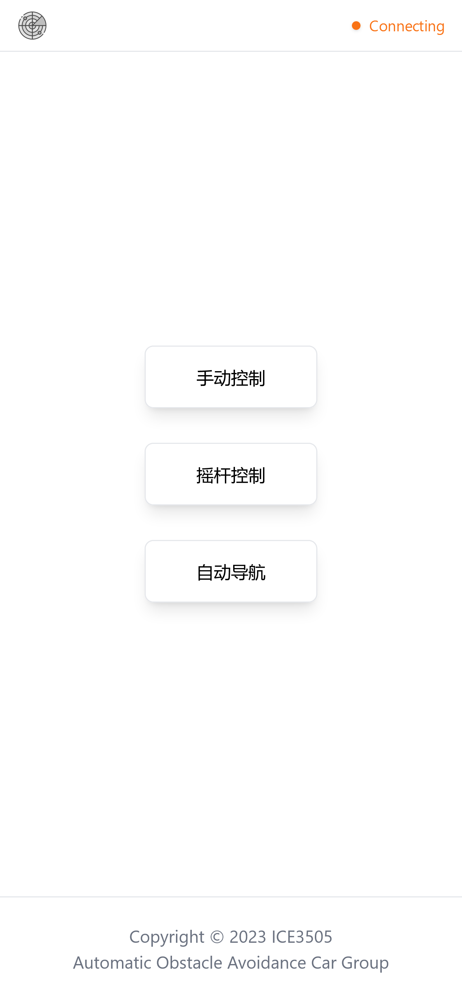

# EPTI4ABOT Web Controller (Frontend)

This project aims at providing a easy-to-use controller interface to user.

## Usage

### Build

Configure `.env` file

```bash
cp .env.example .env
# setup your environment variables
```

Build the project

```bash
pnpm install  # install dependencies
pnpm run build
```

The result files will be saved to `dist/` folder.

### Development

Configure `.env` file

```bash
cp .env.example .env
# setup your environment variables
```

```bash
pnpm install  # install dependencies
pnpm run dev
```

## Roadmap

- [x] Manual Mode
  - [x] Simple Controller
  - [x] Joystick Controller
- [ ] Auto Navigation Mode
- [ ] About Page

## Demo



## Related Projects

- [EPTI4BOT project](https://github.com/hongfanmeng/epti4abot)
- [EPTI4ABOT Backend](TBA)
